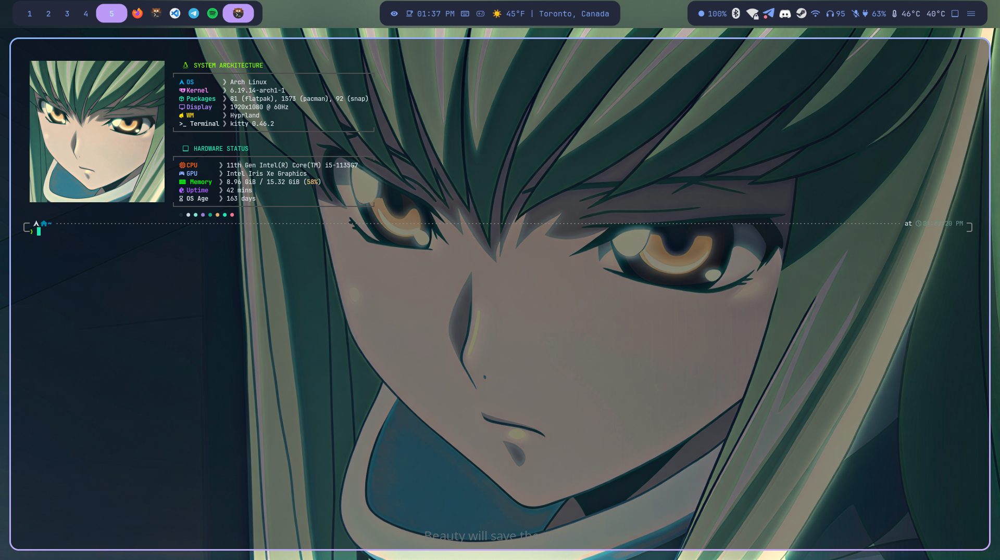
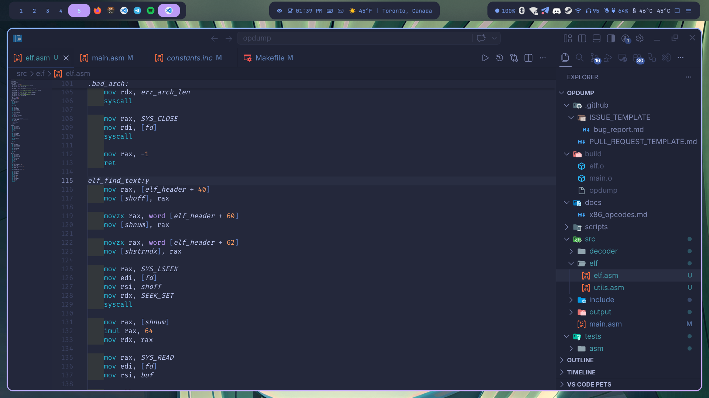
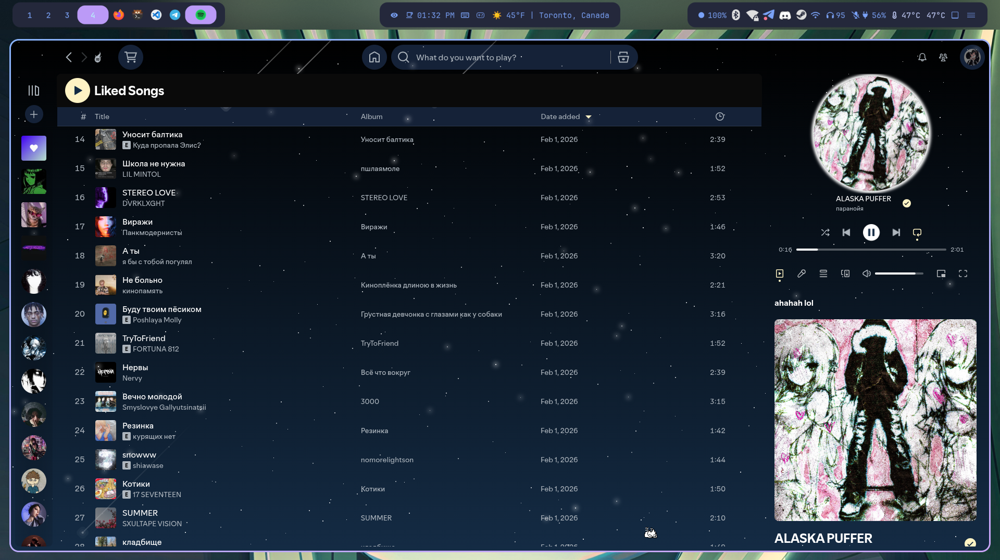
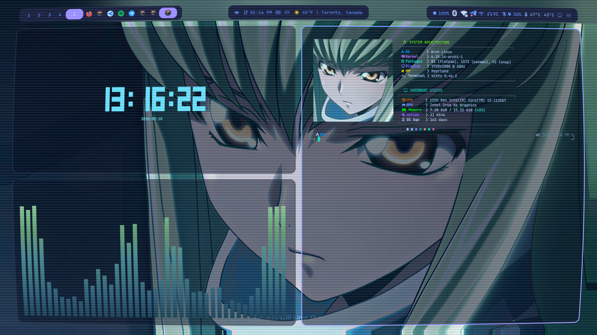
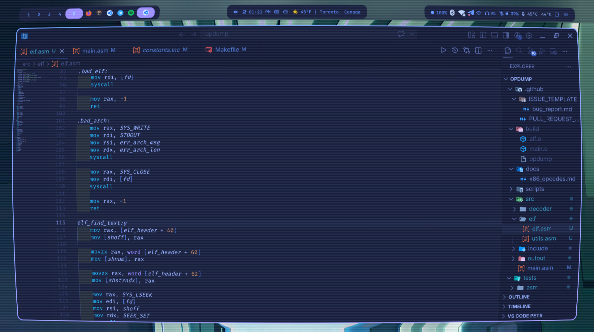
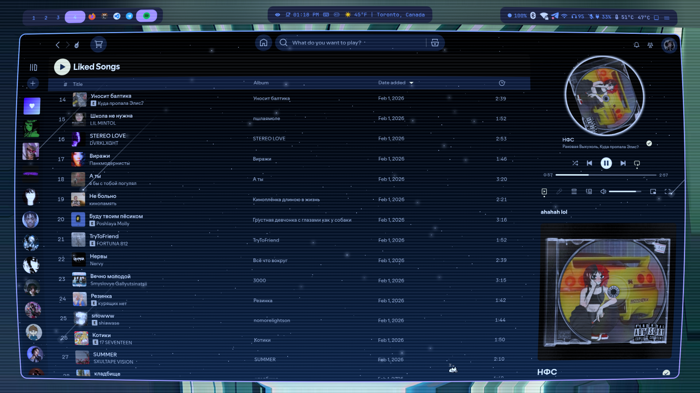

<div align="center">

# 🌸 dotfiles

  [](https://archlinux.org)
  [](https://hyprland.org)
  [](https://wayland.freedesktop.org)
  [](./LICENSE.md)

  <p>【 🇬🇧 Eng 】 <a href="./readme.ua.md">【 🇺🇦 Укр 】</a></p>

[](https://github.com/fxhxyz4/dotfiles/commits/main/README.md)

</div>

| |
|:-:|
| 

| Code | Spotify |
|:-:|:-:|
|  | 

| |
|:-:|


| Code with Shader | Spotify with Shader |
|:-:|:-:|
|  | 

---

# Navigation
 
- [Installation](#installation)
  - [1. Install packages](#1-install-packages)
  - [2. Install HyDE](#2-install-hyde)
  - [3. Restore configs](#3-restore-configs)
  - [After installation](#after-installation)
- [Detailed overview](#detailed-overview)
  - [Dependencies](#dependencies)
  - [Hyprland](#hyprland)
  - [Waybar](#waybar)
  - [Rofi](#rofi)
  - [Mako](#mako)
  - [Wlogout](#wlogout)
  - [Terminal](#terminal)
  - [GTK & Qt](#gtk--qt)
  - [Fastfetch](#fastfetch)
 
> [!IMPORTANT]
> Tested only on **Arch Linux**.
 
---
 
# Installation
 
## 1. Install packages
 
Clone the repository and run the package installation script. It will automatically set up Chaotic-AUR, install yay, and install all packages from the four lists (pacman, AUR, Flatpak, Snap).
 
```bash
git clone https://github.com/fxhxyz4/dotfiles.git ~/dotfiles
cd ~/dotfiles/packages
bash install-packages.sh
```
 
The script installs packages in order:
- Adds **Chaotic-AUR** repository
- Builds and installs **yay** (AUR helper)
- Installs all **pacman** packages from `packages.txt`
- Installs all **AUR** packages from `aur.txt`
- Installs **Flatpak** apps from `flatpak.txt`
- Installs **Snap** apps from `snap.txt`
> [!NOTE]
> If snap packages are skipped, enable snapd first:
> ```bash
> sudo systemctl enable --now snapd snapd.socket
> sudo ln -s /var/lib/snapd/snap /snap
> # reboot, then re-run the script
> ```
 
## 2. Install HyDE
 
HyDE is the DE framework that manages themes, wallpapers, and Hyprland configuration.
 
```bash
git clone https://github.com/HyDE-Project/HyDE.git ~/HyDE
cd ~/HyDE && bash install.sh
```
 
## 3. Restore configs
 
```bash
cp -r ~/dotfiles/configs/* ~/.config/
cp ~/dotfiles/shell/.zshenv ~/
cp ~/dotfiles/misc/.gitconfig ~/
```
 
Enable services:
 
```bash
sudo systemctl enable --now NetworkManager bluetooth sddm tlp ufw docker libvirtd
```
 
Set zsh as default shell:
 
```bash
chsh -s $(which zsh)
```
 
## After installation
 
- Add your wallpapers to `~/Pictures/Wallpapers`
- Run `p10k configure` to set up the terminal prompt
- Install oh-my-zsh if not pulled from configs:
  ```bash
  sh -c "$(curl -fsSL https://raw.githubusercontent.com/ohmyzsh/ohmyzsh/master/tools/install.sh)"
  ```
---
 
# Detailed overview
 
## Dependencies
 
<details>
<summary><b>Hyprland & DE</b></summary>
  
| Package | Description |
| :--- | :--- |
| `hyprland` | Dynamic tiling Wayland compositor |
| `hypridle` | Idle management daemon |
| `hyprlock` | Lock screen |
| `hyprpaper` | Wallpaper daemon |
| `hyprsunset` | Night light daemon |
| `uwsm` | Wayland session manager |
| `waybar` | Status bar |
| `wlogout` | Logout menu |
| `mako` | Notification daemon |
| `rofi` | App launcher |
| `wofi` | App launcher (alternative) |
| `sddm` | Display manager |
| `grim` + `slurp` | Screenshot tools |
| `swappy` + `satty` | Screenshot annotation |
| `wallust` | Colorscheme generator |
| `waypaper-git` | Wallpaper manager GUI |
| `hyde-cli-git` | HyDE CLI tool |
 
</details>

<details>
<summary><b>Audio</b></summary>

| Package | Description |
| :--- | :--- |
| `pipewire` + `wireplumber` | Audio server |
| `pipewire-alsa` + `pipewire-pulse` | Compatibility layers |
| `pamixer` + `pavucontrol` | Volume control |
| `playerctl` | Media player control |
| `mpd` + `ncmpcpp` | Music player + TUI client |
| `cava` | Audio visualizer |
 
</details>
<details>
  
<summary><b>Development</b></summary>

| Package | Description |
| :--- | :--- |
| `code` | Visual Studio Code |
| `jetbrains-toolbox` | JetBrains IDE manager |
| `docker` + `docker-compose` | Containerization |
| `github-desktop-bin` | GitHub Desktop |
| `postman-bin` + `insomnia` | API clients |
| `dbeaver` + `mysql-workbench` | Database GUI |
| `drawio-desktop-bin` | Diagrams |
| `heidisql` | Database client (Wine) |
| `mariadb` + `postgresql` | Databases |
 
</details>

<details>
<summary><b>Security</b></summary>

| Package | Description |
| :--- | :--- |
| `ufw` | Firewall |
| `fail2ban` | Brute-force protection |
| `firejail` | Application sandbox |
| `clamav` | Antivirus |
| `tor` + `obfs4proxy` | Anonymous network |
| `wireshark-qt` | Network analyzer |
| `zaproxy` | Web security scanner |
 
</details>

<details>
<summary><b>Fonts</b></summary>

| Package | Description |
| :--- | :--- |
| `ttf-jetbrains-mono-nerd` | Main terminal font |
| `ttf-cascadia-code-nerd` | Code font |
| `ttf-fira-code` | Ligature font |
| `otf-font-awesome` + `woff2-font-awesome` | Icon fonts |
| `noto-fonts` + `noto-fonts-emoji` | Universal fonts |
| `ttf-victor-mono` | Italic programming font |
 
</details>

---
 
## Hyprland
 
Dynamic tiling Wayland compositor. [[config](configs/hypr/)]
 
- [[hyprland.conf](configs/hypr/hyprland.conf)] — main config
- [[keybindings.conf](configs/hypr/keybindings.conf)] — keyboard shortcuts
- [[windowrules.conf](configs/hypr/windowrules.conf)] — window rules
- [[userprefs.conf](configs/hypr/userprefs.conf)] — personal preferences
- [[monitors.conf](configs/hypr/monitors.conf)] — monitor setup
- [[hypridle.conf](configs/hypr/hypridle.conf)] — idle behavior
- [[hyprlock/](configs/hypr/hyprlock/)] — lock screen layouts

---
 
## Waybar
 
Status bar. [[config](configs/waybar/)]
 
Custom colors in `theme.css`, personal style overrides in `user-style.css`.
 
```bash
sudo pacman -S waybar
```
 
---
 
## Rofi
 
App launcher. [[config](configs/rofi/)]
 
```bash
sudo pacman -S rofi
yay -S rofi-power-menu
```
 
---
 
## Mako
 
Notification daemon. [[config](configs/mako/)]
 
```bash
sudo pacman -S mako
```
 
---
 
## Wlogout
 
Logout menu. [[config](configs/wlogout/)]
 
```bash
yay -S wlogout
```
 
---
 
## Terminal
 
**Emulator** — [Kitty](https://sw.kovidgoyal.net/kitty) [[config](configs/kitty/)]
 
**Shell** — [Zsh](https://www.zsh.org/) + [Oh My Zsh](https://github.com/ohmyzsh/ohmyzsh) [[config](configs/zsh/)]
 
**Prompt** — [Powerlevel10k](https://github.com/romkatv/powerlevel10k) [[config](configs/zsh/.p10k.zsh)]
 
**Alt prompt** — [Starship](https://starship.rs) [[config](configs/starship.toml)]
 
```bash
sudo pacman -S kitty zsh starship
chsh -s $(which zsh)
sh -c "$(curl -fsSL https://raw.githubusercontent.com/ohmyzsh/ohmyzsh/master/tools/install.sh)"
```
 
---
 
## GTK & Qt
 
**GTK theme** — Tokyo Night [[config](configs/gtk-3.0/)]
 
**Icons** — Tela Circle Dracula
 
**Cursor** — Bibata Modern Ice
 
**Qt** — Kvantum [[qt5ct](configs/qt5ct/)] [[qt6ct](configs/qt6ct/)]
 
```bash
sudo pacman -S nwg-look kvantum kvantum-qt5 qt5ct qt6ct
yay -S bibata-cursor-theme tela-icon-theme tokyonight-gtk-theme-git
```
 
---
 
## Fastfetch
 
System info with custom anime logo. [[config](configs/fastfetch/)]
 
```bash
sudo pacman -S fastfetch
```
 
---
 
## Credits
 
- [HyDE Project](https://github.com/HyDE-Project/HyDE) — DE framework
- [Hyprland](https://hyprland.org) — Wayland compositor
- [Tokyo Night](https://github.com/enkia/tokyo-night-vscode-theme) — Color scheme
- [retrilzzy/dotfiles](https://github.com/retrilzzy/dotfiles) — README inspiration
- [r/unixporn](https://reddit.com/r/unixporn) — Community inspiration

